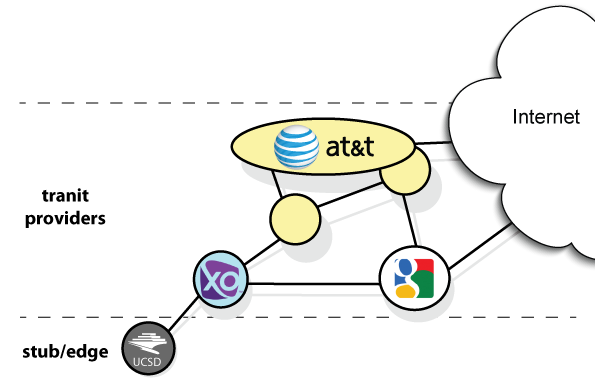
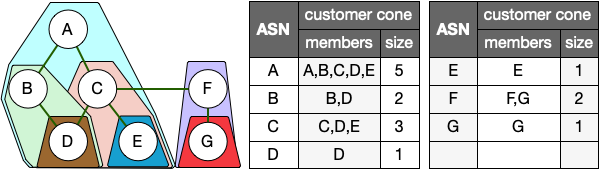

[README](README.md) | Background ⮕ [Datasets](Datasets.md) | [Notebook](nids-asn-introduction.ipynb)

# Introduction and Background

### Reading

- [AS Customer Cone](https://cseweb.ucsd.edu/classes/wi23/cse291-e/slides/cse291e-lecture-03b.pdf) (slides)

An Autonomous System (or AS) is an independently operated network on the Internet — a collection of IP prefixes managed by a single administrative entity under a common routing policy. Each AS is identified by a globally unique **Autonomous System Number (ASN)**. Regional Internet Registries (RIRs), set up in the 1990s, allocate these numbers to organizations that operate network infrastructure. One organization may operate multiple ASNs, for example, to operate separate networks in different geographic regions or service tiers.
CAIDA uses _WHOIS_ information available from Regional and National Internet Registries to infer a mapping from AS numbers to the organizations that operate them. In this assignment you will learn to parse CAIDA's _AS to Organizations_ dataset to analyze properties of this global numbering system.

Large networks that route traffic for others, referred to as transit providers, require significantly more complex routing logic than smaller edge networks that have few or no downstream clients. They may have many thousands of customer networks who pay them for transit service. There is no central or public database of which networks are customers of which other networks; we must infer this from published routing table data.
CAIDA provides such a data set that includes for each AS, the list of other ASes we infer to be customers of that AS; we refer to this list as the inferred **customer cone** for each ASN.
You can think of a customer cone as a metric that defines a node's reach or sphere of influence: essentially, the subset of the network graph that relies on that specific ASN for transit connectivity to the rest of the Internet.

This assignment will introduce you to these datasets (CAIDA's _AS to Organizations_ and _customer cone_) and demonstrate how analysts use them. For example, we can use the size of an AS's customer cone as a metric of that organization's size or importance. We can also arrange the ASes as nodes in a graph reflecting customer-provider relationships. At the bottom of this hierarchy are **stub** or **edge** organizations that pay someone else for all of their Internet access needs. Each stub ASN is a **customer** of its transit **provider's** ASN. This relationship is called a **Provider-Customer (p2c)** relationship, with the customer below its provider in the hierarchy. Each of these transit providers in turn may have a **Provider-Customer** relationship with their own set of transit providers. This chain of **Provider-Customer** links are the foundation of the ASN Customer Cone. The ASN Customer Cone includes the ASN itself and the union of ASNs in its customers' customer cones — that is, the number of ASNs reachable through the target ASN's customers.

Some networks exchange traffic for free in a **Peer-to-Peer** relationship. These links are not used in the calculation of the customer cone. We will go into these in a future module.

For this assignment, you will explore the following two datasets:

- **AS to Organization** - Provides a list of organizations, their names, country, and the ASNs they have registered in the Internet Registries. [ [webpage](https://catalog.caida.org/dataset/as_organizations) | [API](https://api.data.caida.org/as2org/v1/doc) ]
- **CAIDA AS Customer Cone and Relationships** — Provides an ASN's customer cone and the relationships between ASNs [ [paper](https://catalog.caida.org/paper/2013_asrank) | [webpage](https://catalog.caida.org/dataset/as_relationships_serial_1) | [download](https://publicdata.caida.org/datasets/as-relationships/serial-1/) ]

#### Optional Reading

- [Lecture: AS Relationships and Customer Cones](https://cseweb.ucsd.edu/classes/wi23/cse291-e/slides/cse291e-lecture-03.pdf) (slides)
- [Autonomous Systems Topology](https://www.caida.org/catalog/media/2016_as_intro_topology_wind/as_intro_topology_wind.pdf) (slides)
- [AS Relationships, Customer Cones, and Validation
  ](https://catalog.caida.org/paper/2013_asrank) (customer cone paper)
- [ASN 2 Organization](https://catalog.caida.org/dataset/as_organizations) (dataset details)
- [Autonomous system (Internet)](<https://en.wikipedia.org/wiki/Autonomous_system_(Internet)>) (Wikipedia)

[README](README.md) | Background ⮕ [Datasets](Datasets.md) | [Notebook](nids-asn-introduction.ipynb)
